<!-- vim-markdown-toc GFM -->

* [nvim](#nvim)
    * [why nvim](#why-nvim)
    * [常用命令](#常用命令)
        * [-V参数debug](#-v参数debug)
        * [socket通信(需要neovim 0.7)](#socket通信需要neovim-07)
        * [nvr: shell命令控制nvim](#nvr-shell命令控制nvim)
    * [配置](#配置)
    * [tips(技巧)](#tips技巧)
        * [共享远程服务器的剪切板](#共享远程服务器的剪切板)
    * [vim.loop异步消息循环(libuv)](#vimloop异步消息循环libuv)
    * [Plugin](#plugin)
        * [UI 相关](#ui-相关)
            * [floaterm(浮动终端)](#floaterm浮动终端)
        * [File manager(文件管理器)](#file-manager文件管理器)
        * [Search 搜索](#search-搜索)
        * [tags 跳转](#tags-跳转)
        * [lib](#lib)
        * [git](#git)
            * [通过 `floaterm` 插件打开 lazygit 一个 git tui:](#通过-floaterm-插件打开-lazygit-一个-git-tui)
        * [LSP](#lsp)
        * [formatter](#formatter)
        * [DAP](#dap)
    * [编程语言相关的配置](#编程语言相关的配置)
        * [部分代码运行SnipRun](#部分代码运行sniprun)
        * [调试](#调试)
    * [nvim with python](#nvim-with-python)
    * [goneovim: go语言写的qt前端](#goneovim-go语言写的qt前端)
* [reference](#reference)
* [other vim ui](#other-vim-ui)
* [online tool](#online-tool)

<!-- vim-markdown-toc -->
# nvim

## why nvim

即使是最新的 vim8.2 也还在用 `select` 系统调用 ，而 nvim 已经用 `epoll` 了

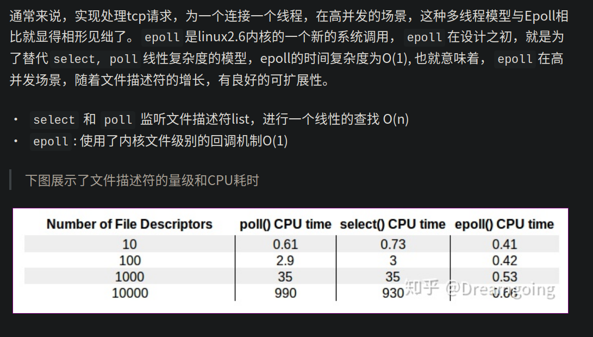

以下统计是 nvim 和 vim 的系统调用测试：

先打开 nvim 和 vim , 然后通过 `strace` 查看它们的系统调用

```bash
sudo strace -p $(pgrep -of nvim) 2>&1 | tee /tmp/nvim.log
sudo strace -p $(pgrep -of vim) 2>&1 | tee /tmp/vim.log
```

分别在 vim 和 nvim 简单的操作后关闭，通过 `awk` 进行统计

```bash
awk -F '(' '{print $1}'  /tmp/nvim.log | sort | uniq -c | sort -n
awk -F '(' '{print $1}'  /tmp/vim.log | sort | uniq -c | sort -n
```

- 左为 `nvim`
- 右为 `vim`
  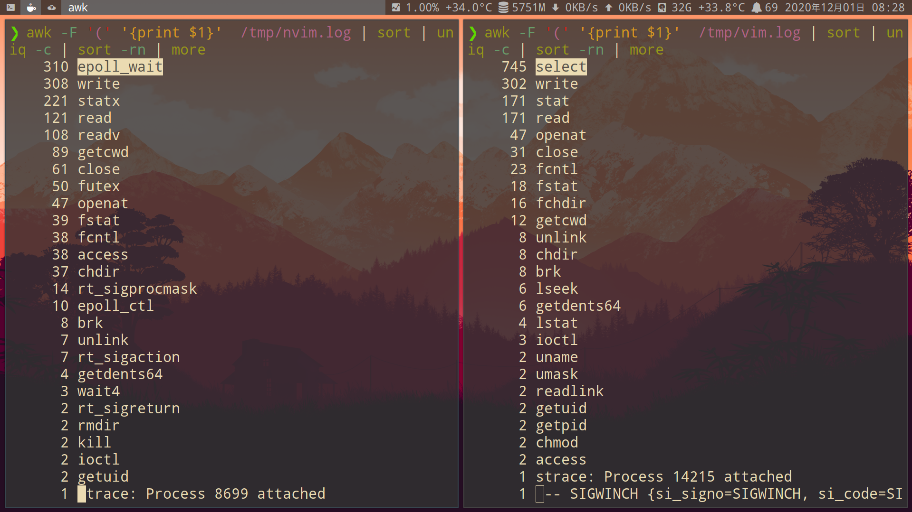

可以用 `nvim -d` 代替 `vimdiff`

- 编辑远程文件

```bash
nvim scp://user@host//etc/fstab
```

在 vim 配置文件加入

```vim
command! Ecentos :e scp://root@192.168.100.208//
command! Esuse :e scp://root@192.168.100.71//
```

## 常用命令

```vim
" 查看map
:map

" 查看command
:command

" 查看autocmd
:autocmd
```

- 加密文件

```sh
# 打开文件需要密码。第一次打开可以设置密码。只支持vim，不支持nvim
vim -x <filename>
```

### -V参数debug

- 默认
```
" 查看mapped key
:verbose map s
v  s             S
        Last set from Lua
n  s             ys
        Last set from Lua
```

- 'nvim -V1'，显示更详细的日志

```
:verbose map s
v  s             S
        Last set from ~/.config/nvim/vim/_editor.lua
n  s             ys
        Last set from ~/.config/nvim/vim/_editor.lua
```

- 设置调试信息为20，并保存为vimlog文件
```sh
nvim -V20vimlog
```

### socket通信(需要neovim 0.7)

- server
```sh
nvim --listen /tmp/nvim.pipe
```

- client
```sh
# 打开文件
nvim --server /tmp/nvim.pipe --remote file

# 执行命令
nvim --server /tmp/nvim.pipe --remote-send ':echo "hello world"<cr>'
```

### [nvr: shell命令控制nvim](https://github.com/mhinz/neovim-remote)

- 安装
```sh
pip3 install neovim-remote
```

- 查看server的path

```vim
echo v:servername
```

- export环境变量,指定server的path

```sh
export NVIM_LISTEN_ADDRESS="/tmp/nvimsocket"

# 或者:nvr指定path
nvr --servername /tmp/nvimsocket
```

- 基本操作

```vim
# 打开文件
nvr file file1

# 查看变量bufname
nvr --remote-expr 'bufname("")'

# 输入指定字符
nvr --remote-send 'iabc<esc>'

# 执行命令
nvr -cc terminal
nvr -c terminal
```

## 配置

- 在学 `linux` 等开源软件的过程中，了解 `vim` 的操作到安装各种高效率**插件**.花费了大量的时间,打造成现在的**配置**.

- 早期参考最多是 [Thinkvim](https://github.com/hardcoreplayers/ThinkVim)

- 现在已经根据自己的需求, 自定义化了

一共有`80` 个插件
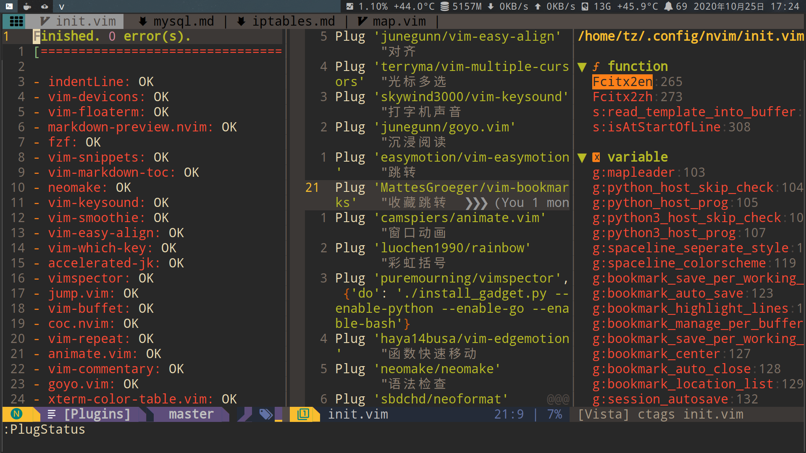

- 可以在 `vim` 打开 `htop` `glance` 等终端命令,进行监控
  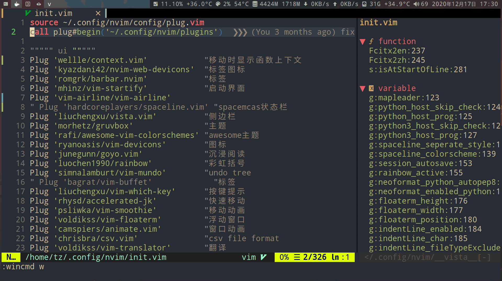

- 快速打开**最近**使用过的文件
  
  

- `ag插件(类似 grep)`预览包含`linux`(我这里输入的是`linux`)的文件,选择文件后在 `vim` 里打开
  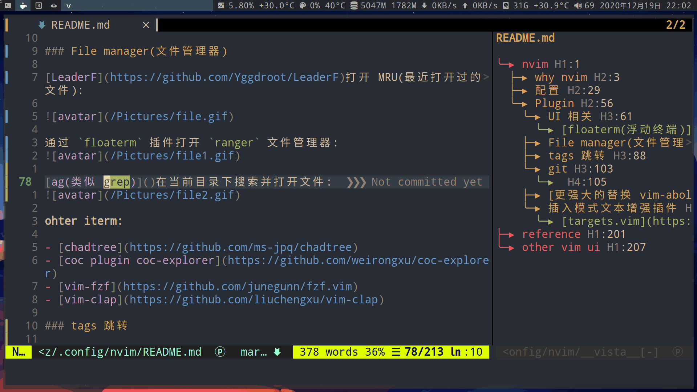

使用`lazygit`,对`git`进行快速管理
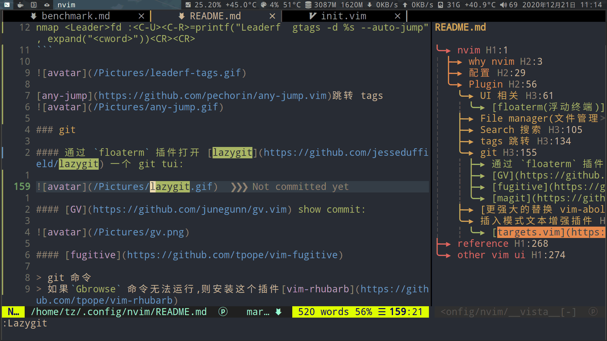

---

- 以上几个插件是比较直观，使用比较多的
- 还有几十个插件,有机会我会一并整理出来

## tips(技巧)

查找中文:
按下 <kbd>/</kbd> 输入 `[^\x00-\xffk]`

### 共享远程服务器的剪切板

- [本地与SSH远程同步NVIM剪切板](https://yaocc.cc/remoteclipboard/)

    - [lemonade:剪切板服务](https://github.com/lemonade-command/lemonade)
    - server:
        ```sh
        # 开启服务器端口为2489
        lemonade server
        ssh -R 2489:127.0.0.1:2489 user@host
        ```
    - client:
        ```sh
        lemonade paste
        ```

## vim.loop异步消息循环(libuv)

- [Using LibUV in Neovim](https://teukka.tech/posts/2020-01-07-vimloop/)

- 通过pandoc将当前buf的mardown文件，转换为html
```lua
local M = {}

function M.convertFile()
	-- 当前buf的文件名不包含扩展名
	local shortname = vim.fn.expand("%:t:r")
	-- 当前buf的文件名
	local fullname = vim.api.nvim_buf_get_name(0)

	-- 通过loop.spawn使用pandoc将mardown文件转换为html
	handle = vim.loop.spawn("pandoc", {
		args = {
			fullname,
			"--to=html5",
			"-o",
			string.format("%s.html", shortname),
			"-s",
			"--highlight-style",
			"tango",
			"-c",
			"--css=pandoc.css",
		},
	}, function()
		print("DOCUMENT CONVERSION COMPLETE")
		handle:close()
	end)
end

return M
```

- Grep

```lua
local M = {}
local results = {}

-- 处理文本的函数。读取到数据时，把数据插入到results表中
local function onread(err, data)
	if err then
		print("ERROR: ", err)
		-- TODO handle err
	end
	if data then
		table.insert(results, data)
	end
end

function M.asyncGrep(term)
	local stdout = vim.loop.new_pipe(false)
	local stderr = vim.loop.new_pipe(false)
	local function setQF()
	    -- 以 Quickfix 列表的形式展示出来
		vim.fn.setqflist({}, "r", { title = "Search Results", lines = results })
		vim.api.nvim_command("cwindow")

		-- 清空results
		local count = #results
		for i = 0, count do
			results[i] = nil
		end
	end
	handle = vim.loop.spawn(
		"rg",
		{
			args = { term, "--vimgrep", "--smart-case" },
			stdio = { nil, stdout, stderr },
		},
		-- 回调函数
		vim.schedule_wrap(function()
			stdout:read_stop()
			stderr:read_stop()
			stdout:close()
			stderr:close()
			handle:close()
			setQF()
		end)
	)
	vim.loop.read_start(stdout, onread)
	vim.loop.read_start(stderr, onread)
end

return M
```

```vim
" 设置Grep命令
command! -nargs=+ -complete=dir -bar Grep lua require'tools'.asyncGrep(<q-args>)
```

## Plugin

```sh
# 查看nvim每个require的启动时间
nvim --startuptime /tmp/nvim-startuptime
```

### UI 相关

#### [floaterm(浮动终端)](https://github.com/voldikss/vim-floaterm)

> 通过浮动终端打开 `htop` `glance`

```vim
" floaterm variable
let g:floaterm_height = 0.9
let g:floaterm_width = 0.9
let g:floaterm_position = 'center'

function! OpenAnimatedHtop() abort
  " Open a htop in terminal
  new term://htop
  " Send window to bottom and start with small height
  wincmd J | resize 1
  " Animate height to 66%
  call animate#window_percent_height(0.66)
endfunction
command! Htop call OpenAnimatedHtop()

"绑定快捷键为<leader>th
nnoremap <leader>th :Htop<CR>
```


### File manager(文件管理器)

[LeaderF](https://github.com/Yggdroot/LeaderF)打开 MRU(最近打开过的文件):

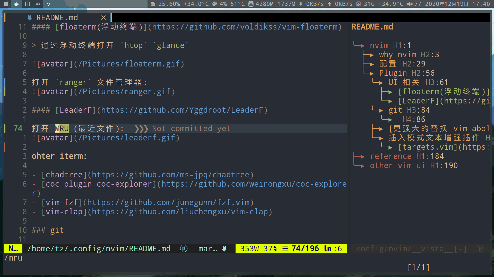

```vim
"快捷键为<leader>fm
nmap <Leader>fm :<C-U><C-R>=printf("Leaderf --regexMode mru %s", "")<CR><CR>
```

通过 `floaterm` 插件打开 [ranger](https://github.com/ranger/ranger) 文件管理器:

```vim
command! Ranger FloatermNew ranger
nmap <Leader>fr :Ranger<CR>
```


**ohter iterm:**

- [chadtree](https://github.com/ms-jpq/chadtree)
- [coc plugin coc-explorer](https://github.com/weirongxu/coc-explorer)
- [vim-fzf](https://github.com/junegunn/fzf.vim)
- [vim-clap](https://github.com/liuchengxu/vim-clap)

### Search 搜索

leaderf 正则表达式搜索当前文件:

```vim
nmap <Leader>f/ :<C-U><C-R>=printf("Leaderf --regexMode line %s", "")<CR><CR>
```

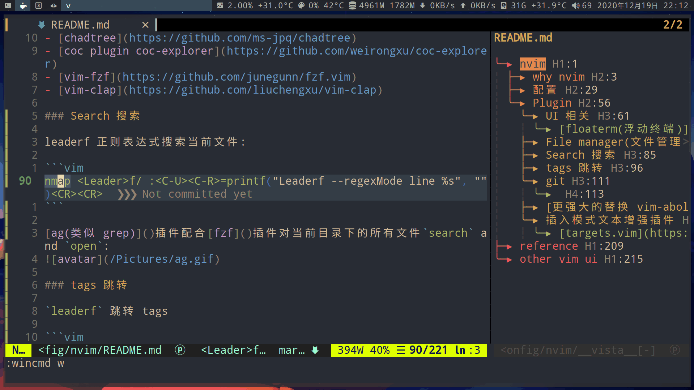

leaderf 在当前文件搜索光标所在的单词:

```vim
nmap <Leader>f. :<C-U><C-R>=printf("Leaderf rg --current-buffer -e %s ", expand("<cword>"))<CR><CR>
```

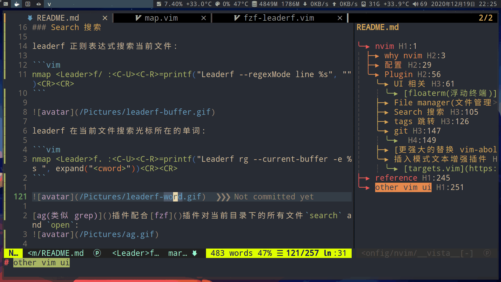

leaderf 在当前文件搜索光标所在的单词:

```vim
nmap <Leader>fa :<C-U><C-R>=printf("Leaderf rg -e %s ", expand("<cword>"))<CR><CR>
```

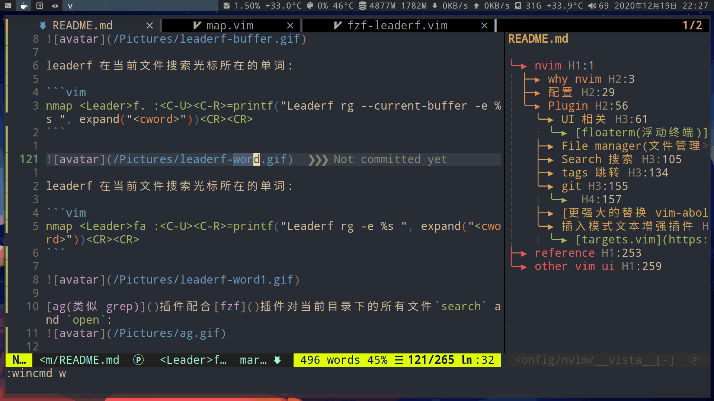

[ag(类似 grep)](https://github.com/ggreer/the_silver_searcher)插件配合[fzf](https://github.com/junegunn/fzf.vim)插件对当前目录下的所有文件`search` and `open`:


### tags 跳转

`leaderf` 跳转 tags

```vim
"自动生成tags
let g:Lf_GtagsAutoGenerate = 1
let g:Lf_Gtagslabel = 'native-pygments'

" 跳转函数声明和调用
nmap <Leader>fe :<C-U><C-R>=printf("Leaderf  gtags -r %s --auto-jump"word, expand("<cword>"))<CR><CR>

" 跳转至函数定义
nmap <Leader>fd :<C-U><C-R>=printf("Leaderf  gtags -d %s --auto-jump", expand("<cword>"))<CR><CR>
```

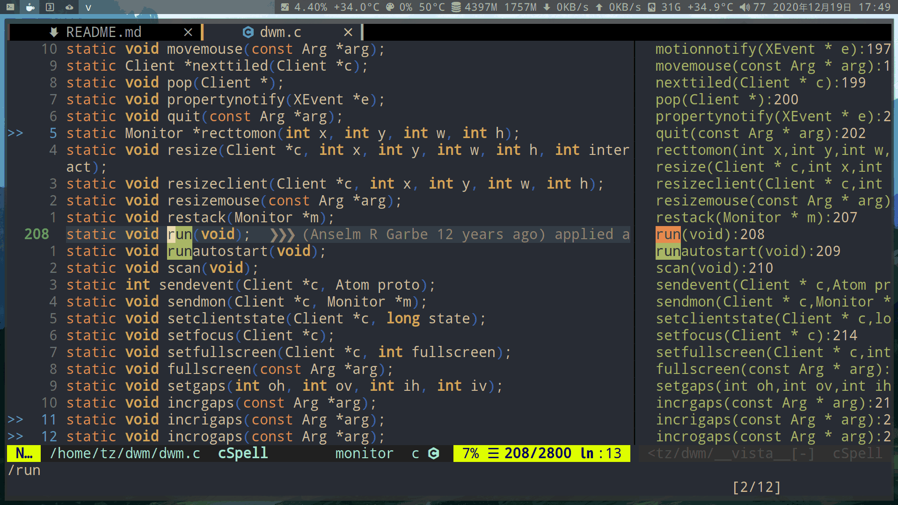

[any-jump](https://github.com/pechorin/any-jump.vim)跳转 tags


### lib

```sh
# 安装nvim-oxi
cargo add nvim-oxi
```

### git

#### 通过 `floaterm` 插件打开 [lazygit](https://github.com/jesseduffield/lazygit) 一个 git tui:


### [LSP](https://github.com/neovim/nvim-lspconfig)

- [Configurations](https://github.com/neovim/nvim-lspconfig/blob/8924812e0d114b67dca376533bef2ac5bb054f8b/CONFIG.md)

安装lsp:

```sh
sudo npm i -g pyright
# or pylsp
pip install python-lsp-server

# html,css,json,js,ts
sudo npm i -g vscode-langservers-extracted

# markdown
paru -S marksman-bin

sudo npm i -g typescript typescript-language-server
sudo npm i -g yaml-language-server
sudo npm i -g bash-language-server
sudo npm i -g vim-language-server
sudo npm i -g dockerfile-language-server-nodejs
sudo npm i -g diagnostic-languageserver
sudo npm install -g ansible-language-server
pip3 install cmake-language-server

# rust
pacman -S rust-analyzer

# go
sudo pacman -S gopls
go install github.com/sqls-server/sqls@latest

# java
paru -S jdtls

# lua-language-server
pacman -S lua-language-server

# 手动编译(失败)
# install ninja
sudo pacman -S ninja
git clone https://github.com/sumneko/lua-language-server
cd lua-language-server
git submodule update --init --recursive

cd 3rd/luamake
./compile/install.sh
cd ../..
./3rd/luamake/luamake rebuild
```

### [formatter]()

- [Configurations](https://github.com/mhartington/formatter.nvim/blob/master/CONFIG.md)

```sh
# python
pip install autopep8

# lua
pacman -S stylua

# js ts json html css yaml xml
pacman -S prettier
paru -S prettierd

# nginx
paru -S nginxbeautifier

# shell
pacman -S shfmt

# c/cpp
paru -S clang-format-static-bin

# go
paru -S gofumpt

# docker
go install github.com/jessfraz/dockfmt@latest

# markdwon
go install github.com/shurcooL/markdownfmt@latest

# sql
go install github.com/jackc/sqlfmt@latest
```

### [DAP](https://github.com/mfussenegger/nvim-dap)

```sh
pip install debugpy
```

## 编程语言相关的配置

### 部分代码运行[SnipRun](https://github.com/michaelb/sniprun)

```py
vmap <F6> :SnipRun<CR>
```
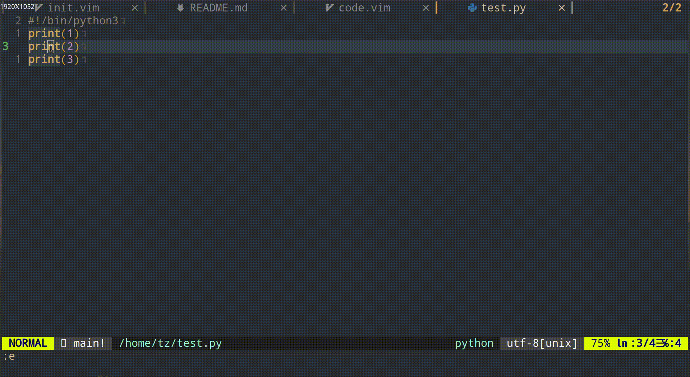

### 调试
```vim
# 使用插件floaterm, 定义终端打开后要执行的命令
command! Pudb FloatermNew python -m pudb %

# 按F5调试当前文件
au FileType python nmap  <F5> :Pudb<CR>
au FileType python imap  <F5> <ESC>:Pudb<CR>
```

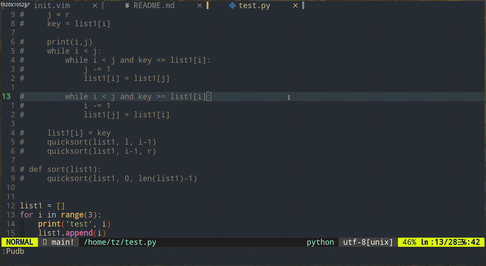

- 按F7使用mypy, 对当前文件, 进行静态类型检查
```vim
au FileType python nmap <F7> :!mypy %:p<CR>
au FileType python imap <F7> <ESC>:!mypy %:p<CR>
```

## nvim with python

```py
from pynvim import attach
# 连接socket
nvim = attach('socket', path='/tmp/nvimsocket')

# 打开文件
nvim.vars['file_to_edit1'] = '/home/tz/.zshrc'

# 执行命令
nvim.command('exe "edit " . g:file_to_edit1')

# 输入
nvim.input('')
```

## [goneovim: go语言写的qt前端](https://github.com/akiyosi/goneovim)

# reference

- [Vim 从入门到精通](https://github.com/wsdjeg/vim-galore-zh_cn)

- [cheatsheet](https://github.com/skywind3000/awesome-cheatsheets/blob/master/editors/vim.txt)

- [nvim-lua-guide](https://github.com/nanotee/nvim-lua-guide)

- [awesome-neovim](https://github.com/rockerBOO/awesome-neovim)

- [vimcolorschemes：可以查看各种主题的配色](https://vimcolorschemes.com/)

# other vim ui

- [gonvim](https://github.com/dzhou121/gonvim)

- [nvui](https://github.com/rohit-px2/nvui)

- [LunarVim](https://github.com/LunarVim/LunarVim)

- [Spacevim](https://github.com/SpaceVim/SpaceVim)

- [oni 用 typescript 开发的 Electron 增强版 nvim](https://github.com/onivim/oni)

- [kakoune](https://github.com/mawww/kakoune)
  > 一个类似 vim 操作模式的编辑器

- [helix：内置了lsp、treesitter的类似vim的编辑器](https://github.com/helix-editor/helix)

- [zed：支持Tree-sitter.类似vim的编辑器](https://github.com/zed-industries/zed)

# online tool

- [在线vim](https://www.vimonlineeditor.com/)

- [Discover and share Neovim plugins](https://dotfyle.com/)
