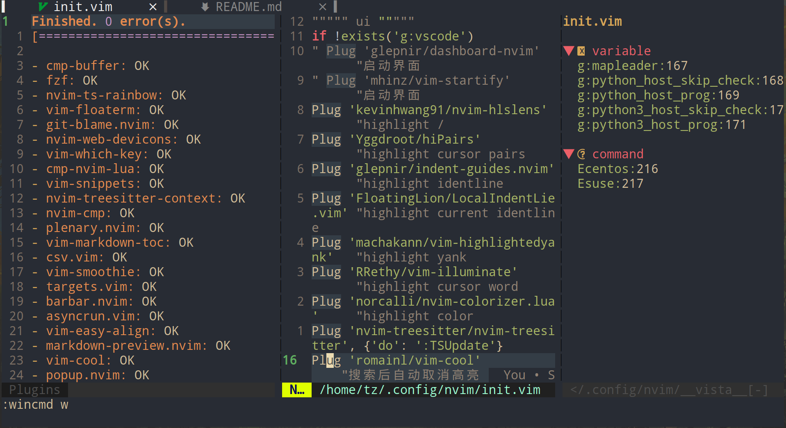
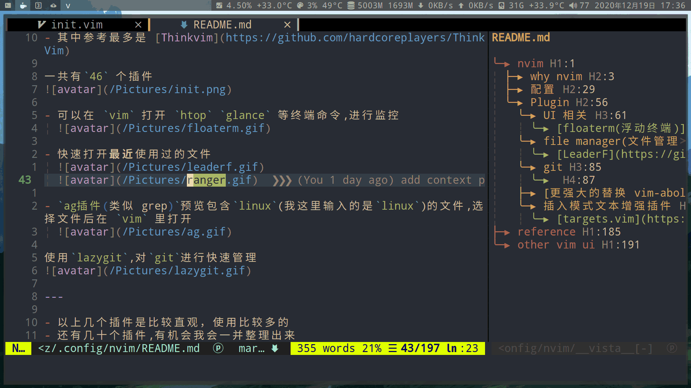

<!-- vim-markdown-toc GFM -->

* [nvim](#nvim)
    * [why nvim](#why-nvim)
    * [常用命令](#常用命令)
        * [nvr: shell命令控制nvim](#nvr-shell命令控制nvim)
    * [配置](#配置)
    * [tips(技巧)](#tips技巧)
    * [Plugin](#plugin)
        * [UI 相关](#ui-相关)
            * [floaterm(浮动终端)](#floaterm浮动终端)
        * [File manager(文件管理器)](#file-manager文件管理器)
        * [Search 搜索](#search-搜索)
        * [tags 跳转](#tags-跳转)
        * [git](#git)
            * [通过 `floaterm` 插件打开 lazygit 一个 git tui:](#通过-floaterm-插件打开-lazygit-一个-git-tui)
            * [GV show commit:](#gv-show-commit)
            * [fugitive](#fugitive)
            * [magit](#magit)
        * [更强大的替换和驼峰命名 vim-abolish](#更强大的替换和驼峰命名-vim-abolish)
            * [替换](#替换)
            * [驼峰命名](#驼峰命名)
        * [插入模式文本增强插件](#插入模式文本增强插件)
            * [targets.vim 增强 normal 模式下的 <kbd>di</kbd>和 <kbd>da`](#targetsvim-增强-normal-模式下的-kbddikbd和-kbdda)
        * [LSP](#lsp)
        * [lspkind](#lspkind)
        * [kite](#kite)
        * [tabnine](#tabnine)
        * [formatter](#formatter)
        * [DAP](#dap)
    * [编程语言相关的配置](#编程语言相关的配置)
        * [部分代码运行SnipRun](#部分代码运行sniprun)
        * [调试](#调试)
    * [nvim with python](#nvim-with-python)
    * [goneovim: go语言写的qt前端](#goneovim-go语言写的qt前端)
* [reference](#reference)
* [other vim ui](#other-vim-ui)

<!-- vim-markdown-toc -->

# nvim

## why nvim

即使是最新的 vim8.2 也还在用 `select` 系统调用 ，而 nvim 已经用 `epoll` 了


以下统计是 nvim 和 vim 的系统调用测试：

先打开 nvim 和 vim , 然后通过 `strace` 查看它们的系统调用

```bash
sudo strace -p $(pgrep -of nvim) 2>&1 | tee /tmp/nvim.log
sudo strace -p $(pgrep -of vim) 2>&1 | tee /tmp/vim.log
```

分别在 vim 和 nvim 简单的操作后关闭，通过 `awk` 进行统计

```bash
awk -F '(' '{print $1}'  /tmp/nvim.log | sort | uniq -c | sort -n
awk -F '(' '{print $1}'  /tmp/vim.log | sort | uniq -c | sort -n
```

- 左为 `nvim`
- 右为 `vim`
  

可以用 `nvim -d` 代替 `vimdiff`

- 编辑远程文件

```bash
nvim scp://user@host//etc/fstab
```

在 vim 配置文件加入

```vim
command! Ecentos :e scp://root@192.168.100.208//
command! Esuse :e scp://root@192.168.100.71//
```

## 常用命令

```vim
# 查看mapped key
:verbose nmap j
```

### [nvr: shell命令控制nvim](https://github.com/mhinz/neovim-remote)

- 查看server的path

```vim
echo v:servername
```

- export环境变量,指定server的path

```sh
export NVIM_LISTEN_ADDRESS="/tmp/nvimsocket"

# 或者:nvr指定path
nvr --servername /tmp/nvimsocket
```

- 基本操作

```vim
# 打开文件
nvr file file1

# 查看变量bufname
nvr --remote-expr 'bufname("")'

# 输入指定字符
nvr --remote-send 'iabc<esc>'

# 执行命令
nvr -cc terminal
nvr -c terminal
```

## 配置

- 在学 `linux` 等开源软件的过程中，了解 `vim` 的操作到安装各种高效率**插件**.花费了大量的时间,打造成现在的**配置**.

- 早期参考最多是 [Thinkvim](https://github.com/hardcoreplayers/ThinkVim)

- 现在已经根据自己的需求, 自定义化了

一共有`80` 个插件


- 可以在 `vim` 打开 `htop` `glance` 等终端命令,进行监控
  

- 快速打开**最近**使用过的文件
  
  

- `ag插件(类似 grep)`预览包含`linux`(我这里输入的是`linux`)的文件,选择文件后在 `vim` 里打开
  

使用`lazygit`,对`git`进行快速管理


---

- 以上几个插件是比较直观，使用比较多的
- 还有几十个插件,有机会我会一并整理出来

## tips(技巧)

查找中文:
按下 <kbd>/</kbd> 输入 `[^\x00-\xffk]`

## Plugin

- [查看每个 plugin 的启动时间](https://github.com/hyiltiz/vim-plugins-profile)
```sh
python ./vim-plugins-profile.py nvim
Running nvim to generate startup logs... done.
Loading and processing logs... done.
Plugin directory: /home/tz/.local/share/nvim/site/pack/packer/start
=====================================
Top 10 plugins slowing nvim's startup
=====================================
1        13.375   nvim-moonmaker
2         5.646   vim-test
3         4.966   vim-matchup
4         3.495   barbar.nvim
5         3.089   vimpeccable
6         2.970   vim-visual-multi
7         2.955   conjure
8         2.201   symbols-outline.nvim
9         1.776   sniprun
10        1.257   nvim-treesitter
=====================================
```

### UI 相关

#### [floaterm(浮动终端)](https://github.com/voldikss/vim-floaterm)

> 通过浮动终端打开 `htop` `glance`

```vim
" floaterm variable
let g:floaterm_height = 0.9
let g:floaterm_width = 0.9
let g:floaterm_position = 'center'

function! OpenAnimatedHtop() abort
  " Open a htop in terminal
  new term://htop
  " Send window to bottom and start with small height
  wincmd J | resize 1
  " Animate height to 66%
  call animate#window_percent_height(0.66)
endfunction
command! Htop call OpenAnimatedHtop()

"绑定快捷键为<leader>th
nnoremap <leader>th :Htop<CR>
```


### File manager(文件管理器)

[LeaderF](https://github.com/Yggdroot/LeaderF)打开 MRU(最近打开过的文件):


```vim
"快捷键为<leader>fm
nmap <Leader>fm :<C-U><C-R>=printf("Leaderf --regexMode mru %s", "")<CR><CR>
```

通过 `floaterm` 插件打开 [ranger](https://github.com/ranger/ranger) 文件管理器:

```vim
command! Ranger FloatermNew ranger
nmap <Leader>fr :Ranger<CR>
```


**ohter iterm:**

- [chadtree](https://github.com/ms-jpq/chadtree)
- [coc plugin coc-explorer](https://github.com/weirongxu/coc-explorer)
- [vim-fzf](https://github.com/junegunn/fzf.vim)
- [vim-clap](https://github.com/liuchengxu/vim-clap)

### Search 搜索

leaderf 正则表达式搜索当前文件:

```vim
nmap <Leader>f/ :<C-U><C-R>=printf("Leaderf --regexMode line %s", "")<CR><CR>
```


leaderf 在当前文件搜索光标所在的单词:

```vim
nmap <Leader>f. :<C-U><C-R>=printf("Leaderf rg --current-buffer -e %s ", expand("<cword>"))<CR><CR>
```


leaderf 在当前文件搜索光标所在的单词:

```vim
nmap <Leader>fa :<C-U><C-R>=printf("Leaderf rg -e %s ", expand("<cword>"))<CR><CR>
```


[ag(类似 grep)](https://github.com/ggreer/the_silver_searcher)插件配合[fzf](https://github.com/junegunn/fzf.vim)插件对当前目录下的所有文件`search` and `open`:


### tags 跳转

`leaderf` 跳转 tags

```vim
"自动生成tags
let g:Lf_GtagsAutoGenerate = 1
let g:Lf_Gtagslabel = 'native-pygments'

" 跳转函数声明和调用
nmap <Leader>fe :<C-U><C-R>=printf("Leaderf  gtags -r %s --auto-jump"word, expand("<cword>"))<CR><CR>

" 跳转至函数定义
nmap <Leader>fd :<C-U><C-R>=printf("Leaderf  gtags -d %s --auto-jump", expand("<cword>"))<CR><CR>
```


[any-jump](https://github.com/pechorin/any-jump.vim)跳转 tags


### git

#### 通过 `floaterm` 插件打开 [lazygit](https://github.com/jesseduffield/lazygit) 一个 git tui:


#### [GV](https://github.com/junegunn/gv.vim) show commit:


#### [fugitive](https://github.com/tpope/vim-fugitive)

> git 命令

如果`Gbrowse` 命令无法运行,则安装这个插件[vim-rhubarb](https://github.com/tpope/vim-rhubarb)

#### [magit](https://github.com/jreybert/vimagit)


### [更强大的替换和驼峰命名 vim-abolish](https://github.com/tpope/vim-abolish)

#### 替换

示例文本:

```
test
tesa
TEST
TESA

替换后

hello
hello
HELLO
HELLO
```

`vim` 自带的替换，不区分大小写，**因此要 **4** 条命令:**

```vim
:%s/TEST/HELLO/g
:%s/test/hello/g
:%s/TESA/HELLO/g
:%s/tesa/hello/g
```

而插件会自动识别大小写，**只需 1 条命令:**

```vim
:%Subvert/tes{t,a}/hello/g
```

缺点不支持特殊字符:
绑定快捷键为 <kbd> \ </kbd>:

```vim
nmap \ :%Subvert//g<Left><Left>
vnmap \  mnmap \  anmap \  pnmap \   \ :Subvert//g<Left><Left>
```

#### 驼峰命名

<kbd>crm</kbd>     `word_test` -> `WordTest`

<kbd>cru</kbd>     `word_test` -> `WORD_TEST`

<kbd>cr-</kbd>     `word_test` -> `word-test`

<kbd>cr空格</kbd>  `word_test` -> `word test`

<kbd>crt</kbd>     `word_test` -> `Word Test`

<kbd>crs</kbd>     `WordTest` -> `word_test`

### 插入模式文本增强插件

| 命令                                                      | 操作内容                              |
| --------------------------------------------------------- | ------------------------------------- |
| [commentary.vim](https://github.com/tpope/vim-commentary) | **注释**                              |
| gcc                                                       | 注释或取消注释行                      |
| gap                                                       | 注释或取消注释段落                    |
|                                                           |                                       |
| [targets.vim](#targets)                                   | **增强 normal 模式下的 `di` 和 `da`** |
| d2i(                                                      | (b(a)b) -> ()                         |
| dI(                                                       | ( b ) -> ( )                          |

<span id="targets"></span>

#### [targets.vim](https://github.com/wellle/targets.vim#separator-text-objects) 增强 normal 模式下的 <kbd>di</kbd>和 <kbd>da`

**示例文本:**

```vim
(b(a)b)
───┘
```

输入: <kbd>di(`

```vim
(b()b)
```

而输入: <kbd>d2i(</kbd>会删除第二括号内的内容

```vim
()
```

**示例文本 2:**

```vim
' test '
───┘
```

输入: <kbd>di'</kbd>不保留空格

```vim
''
```

输入: <kbd>dI'</kbd>会保留空格

```vim
'  '
```

### [LSP](https://github.com/neovim/nvim-lspconfig)

- [Configurations](https://github.com/neovim/nvim-lspconfig/blob/8924812e0d114b67dca376533bef2ac5bb054f8b/CONFIG.md)

安装lsp:

```sh
sudo npm i -g pyright
# or pylsp
pip install python-lsp-server

# html,css,json,js,ts
sudo npm i -g vscode-langservers-extracted

# markdown
sudo npm i -g unified-language-server
sudo npm i -g markdown-language-server

sudo npm i -g typescript typescript-language-server
sudo npm i -g yaml-language-server
sudo npm i -g bash-language-server
sudo npm i -g vim-language-server
sudo npm i -g dockerfile-language-server-nodejs
sudo npm i -g diagnostic-languageserver
sudo npm install -g ansible-language-server
pip3 install cmake-language-server

# go
sudo pacman -S gopls
go get github.com/lighttiger2505/sqls

# java
yay -S jdtls

# lua-language-server
pacman -S lua-language-server

# 手动编译(失败)
# install ninja
sudo pacman -S ninja
git clone https://github.com/sumneko/lua-language-server
cd lua-language-server
git submodule update --init --recursive

cd 3rd/luamake
./compile/install.sh
cd ../..
./3rd/luamake/luamake rebuild
```

### [lspkind](https://github.com/onsails/lspkind-nvim)

- lsp图标

### [kite](https://github.com/kiteco/vim-plugin)

    > AI 补全

- install kite(大小500M)

- 默认路径为 `~/.local/share/kite`

```sh
wget -O kite-installer.sh https://linux.kite.com/dls/linux/current
bash kite-installer.sh --download
bash kite-installer.sh --install
```

### [tabnine](https://github.com/codota/tabnine-vim)

    > AI 补全. 训练了GitHub 200万源代码, 插件大小500M

### [formatter]()

- [Configurations](https://github.com/mhartington/formatter.nvim/blob/master/CONFIG.md)

```sh
# python
autopep8

# lua
stylua
```

### [DAP](https://github.com/mfussenegger/nvim-dap)

```sh
pip install debugpy
```

## 编程语言相关的配置

### 部分代码运行[SnipRun](https://github.com/michaelb/sniprun)

```py
vmap <F6> :SnipRun<CR>
```


### 调试
```vim
# 使用插件floaterm, 定义终端打开后要执行的命令
command! Pudb FloatermNew python -m pudb %

# 按F5调试当前文件
au FileType python nmap  <F5> :Pudb<CR>
au FileType python imap  <F5> <ESC>:Pudb<CR>
```


- 按F7使用mypy, 对当前文件, 进行静态类型检查
```vim
au FileType python nmap <F7> :!mypy %:p<CR>
au FileType python imap <F7> <ESC>:!mypy %:p<CR>
```

## nvim with python

```py
from pynvim import attach
# 连接socket
nvim = attach('socket', path='/tmp/nvimsocket')

# 打开文件
nvim.vars['file_to_edit1'] = '/home/tz/.zshrc'

# 执行命令
nvim.command('exe "edit " . g:file_to_edit1')

# 输入
nvim.input('')
```

## [goneovim: go语言写的qt前端](https://github.com/akiyosi/goneovim)

# reference

- [Vim 从入门到精通](https://github.com/wsdjeg/vim-galore-zh_cn)

- [cheatsheet](https://github.com/skywind3000/awesome-cheatsheets/blob/master/editors/vim.txt)

- [nvim-lua-guide](https://github.com/nanotee/nvim-lua-guide)

- [awesome-neovim](https://github.com/rockerBOO/awesome-neovim)

# other vim ui

- [gonvim](https://github.com/dzhou121/gonvim)

- [nvui](https://github.com/rohit-px2/nvui)

- [LunarVim](https://github.com/LunarVim/LunarVim)

- [Spacevim](https://github.com/SpaceVim/SpaceVim)

- [oni 用 typescript 开发的 Electron 增强版 nvim](https://github.com/onivim/oni)

- [kakoune](https://github.com/mawww/kakoune)
  > 一个类似 vim 操作模式的编辑器
